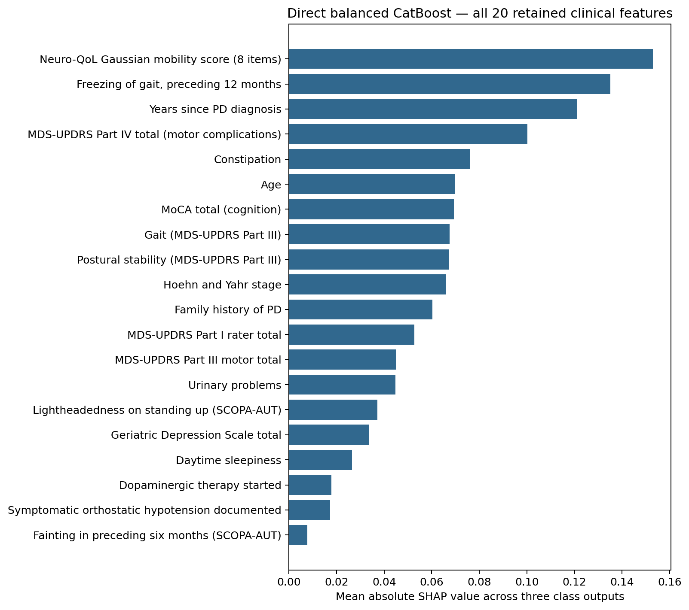
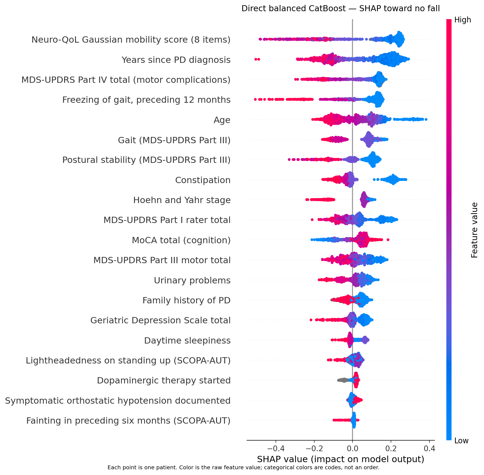
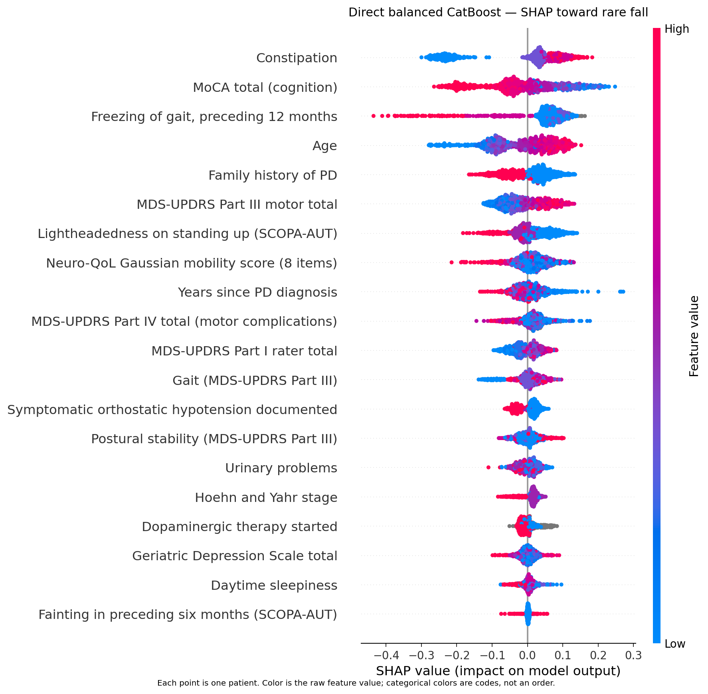
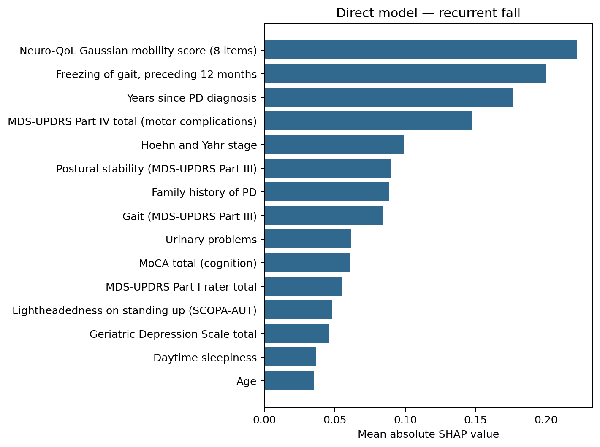
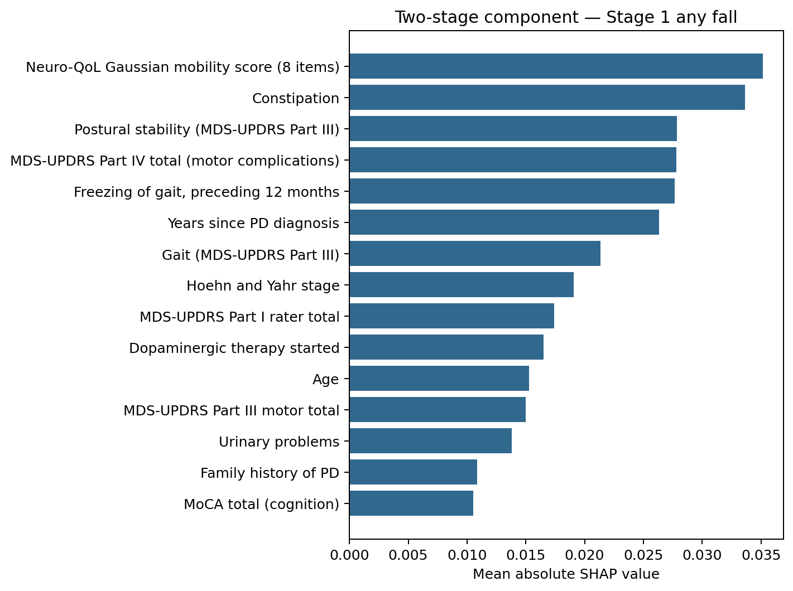
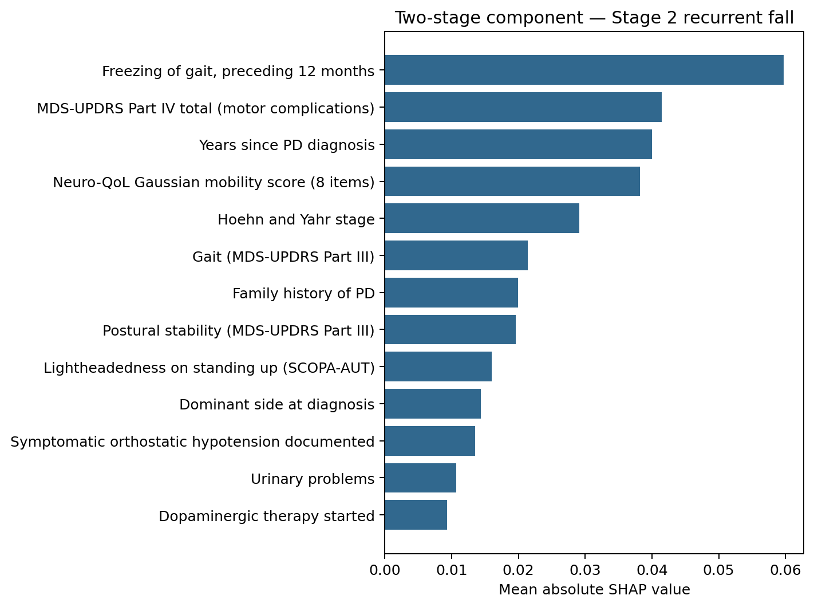

# Modeling Results Report: Final Fall-Risk Prediction Pipeline

**Updated:** 25 September 2026
**Status:** Final 26-feature run through SHAP and LLM handoff

## 1. Executive summary

The final analysis predicts three fall-risk classes for people with
Parkinson's disease: no fall, rare fall, and recurrent fall. It uses a
patient-specific landmark so every predictor is available before the future
12-month fall period being predicted.

The primary cohort contains 1,040 patients: 712 no fall, 227 rare fall, and
101 recurrent fall. The model starts from 26 candidate predictors. Neuro-QoL
mobility enters once through the revision's 8-item Gaussian composite. Seven
individual items that contributed to the same score were removed before this
authoritative run to avoid representing the same questionnaire twice.

Across 20 paired train/test splits:

| Result | Direct three-class | Two-stage |
| :--- | ---: | ---: |
| Macro F1 | **0.513 ± 0.019** | **0.510 ± 0.019** |
| Rare-fall recall | **0.384 ± 0.056** | **0.351 ± 0.068** |
| No-fall recall | 0.710 ± 0.045 | **0.743 ± 0.038** |
| Recurrent-fall recall | **0.557 ± 0.102** | 0.522 ± 0.159 |

The direct model had a mean macro-F1 advantage of 0.003, but its approximate
corrected 95% interval was -0.034 to 0.041. Its rare-fall recall advantage was
0.033, with interval -0.053 to 0.119. The current data therefore do not
establish that either architecture is better. The direct model tended to find
more rare and recurrent fallers, while the two-stage model tended to identify
more non-fallers.

All five one-change sensitivity comparisons had macro-F1 intervals that
included zero. None provides evidence to replace the primary aggregation,
cohort, 101 handling, or preprocessing choices.

For the models refitted on all 1,040 patients, the training-only procedure
selected balanced CatBoost for direct classification, balanced Extra Trees
for Stage 1, and an unweighted random forest for Stage 2. These full-cohort
fits are interpretation and future-use artifacts; their training performance
is not a new estimate of generalization.

| Final fitted target | Selected feature configuration | Selected model |
| :--- | :--- | :--- |
| Direct three-class | Raw representation; corrected FDR; 20 clinical groups | Balanced CatBoost |
| Stage 1: no fall/any fall | Raw representation; corrected FDR; the same 20 groups | Balanced Extra Trees |
| Stage 2: rare/recurrent | Raw representation; median-threshold Extra-Trees selector; 13 groups | Unweighted random forest |

Section 6 lists the retained groups, preprocessing, routing rule, and exact
model settings. Both direct and two-stage configurations are retained because
the paired evaluation did not establish an architecture-level winner.

Held-out permutation analysis found that the direct model's macro F1 relied
most on constipation, freezing of gait, the Neuro-QoL mobility composite,
age, and the Part III motor total. The two-stage system relied most on
freezing, Part IV motor complications, and the Neuro-QoL composite. These are
model-dependence results, not causal effects or a reason to change the frozen
feature-selection procedure.

## 2. Study design

### 2.1 Cohort and outcome

| Step | Patients |
| :--- | ---: |
| PD participants with an observed, dated fall outcome | 1,280 |
| With at least one eligible paper-aligned predictor | 1,043 |
| **Primary cohort with eligible longitudinal clinical history** | **1,040** |

The outcome comes from `FLNFR12M`, which records falls not related to freezing
during the preceding 12 months. It is mapped to:

- 0: no fall;
- 1: rare fall; and
- 2–4: recurrent fall.

The primary cohort contains 712, 227, and 101 patients in those classes,
respectively. The outcome is never imputed.

### 2.2 Landmark design

For each patient:

1. The selected outcome visit fixes the end of the 12-month fall window.
2. The landmark, or prediction date, is 12 calendar months before that visit.
3. Only predictor records dated on or before the landmark are eligible.
4. Age and Parkinson's disease duration are calculated at the landmark.

For example, a September 2025 outcome reports falls occurring roughly from
September 2024 through September 2025. The landmark is September 2024, and
only information available by that month may be used to predict that future
fall window. This prevents information from the period being predicted from
entering the model.

### 2.3 Candidate predictors

The final universe contains 25 eligible paper-aligned variables plus maximum
eligible patient-reported constipation, for 26 candidates.

| Aggregation meaning | Predictors |
| :--- | :--- |
| Calculated at the landmark | Age; years since PD diagnosis |
| Eligible diagnosis characteristics | Postural instability, rigidity, tremor, and bradykinesia at diagnosis; dominant side at diagnosis |
| Most recent eligible status | MoCA cognition total; complete GDS-15 total; body mass index; 8-item Neuro-QoL Gaussian mobility composite |
| Greatest eligible historical burden | Freezing of gait; SCOPA-AUT lightheadedness and fainting; MDS-UPDRS Part I rater total; daytime sleepiness; urinary problems; constipation; Part III motor total, gait, and postural stability; Hoehn and Yahr stage; Part IV complications total |
| Eligible documented history | Dopaminergic therapy started; family history of PD; symptomatic orthostatic hypotension |

The Neuro-QoL input is the revision's Gaussian score calculated from one
coherent 8-item mobility form. It is not a standard Neuro-QoL total or T-score.
Its seven previously duplicated component items are needed to calculate the
score but are not separate candidates. The earlier 33-feature execution is
superseded for that reason, independent of whether its performance was higher
or lower.

Part III scores use maximum eligible values across medication ON and OFF
examinations. Codebook-defined `101 = unable to rate` values become missing,
without excluding the patient. Separate ON/OFF values and 101-status flags are
evaluated only as named sensitivities. Longitudinal delta features are not
used.

### 2.4 Missing data

Every learned missing-data value is fitted using training patients only.

- Missing freezing, Neuro-QoL, and Part IV forms receive indicators.
- A wholly absent Part IV form becomes structural zero only when dopamine
  therapy is explicitly recorded as not started.
- Unknown family and dopamine histories remain explicit missing categories.
- Dense models receive training-fold medians or modes.
- Compatible boosting models retain native numeric missing values.

No globally imputed patient table is used.

### 2.5 Evaluation and model search

The evaluation uses 20 paired, stratified 70/30 splits generated with seeds
0–19. Each split contains 728 training and 312 test patients. Within each
outer-training set, five stratified inner folds select preprocessing,
engineering, feature selection, model family, and hyperparameters. The outer
test set is scored once and never feeds back into those choices.

Four feature-selection approaches compete inside training data:

- **All candidates:** retain all 26 source-variable groups after preprocessing.
- **FDR statistical screening:** test each group using only the current
  training fold and retain groups with Benjamini-Hochberg-adjusted
  `q <= 0.05`.
- **L1 sparse selection:** fit an L1-penalized logistic model inside the
  training fold and retain groups with nonzero coefficients.
- **Tree-importance selection:** fit an Extra-Trees selector inside the
  training fold and retain groups meeting its prespecified median or
  1.25-times-median importance threshold.

Four prespecified clinical interactions and three PCA thresholds for the
sleepiness, urinary-problems, and constipation block also compete as
**engineered-representation candidates**. Each candidate adds one named
interaction or replaces those three Part I items with their training-fitted
principal components. The removed Neuro-QoL items cannot re-enter through
PCA.

Nine model families are screened: logistic regression, linear SVM, RBF SVM,
random forest, Extra Trees, histogram gradient boosting, XGBoost, LightGBM,
and CatBoost. Two feature-pipeline/model combinations advance per target and
split, after which the fixed grids tune one winner.

Selection uses mean inner-fold macro F1. Candidates within 0.01 use rare-fall
recall as the tie-break for the direct model and Stage 2, and any-fall recall
for Stage 1. Remaining ties prefer fewer features and then the prespecified
simpler model.

## 3. Statistical feature analysis

The requested univariate analysis tests whether each candidate differs across
the three outcome groups. Numeric and ordinal variables use Kruskal-Wallis;
categorical variables use chi-square or a permutation version for sparse
tables. Tests use observed values, report effect sizes, and apply
Benjamini-Hochberg false-discovery-rate correction within each training
partition.

The analysis was repeated in the 100 inner-training partitions: 20 outer
splits times five inner folds. These overlapping partitions measure stability;
they are not 100 independent replications.

- **16 of 26 variables were FDR-significant in all 100 partitions.**
- Eight were significant in some partitions.
- Dominant side and tremor at diagnosis were significant in none.

The five largest median numeric effect sizes were:

| Variable | Median epsilon-squared | Significant partitions |
| :--- | ---: | ---: |
| Neuro-QoL Gaussian mobility score | 0.156 | 100/100 |
| Freezing of gait | 0.153 | 100/100 |
| Hoehn and Yahr stage | 0.150 | 100/100 |
| Part III gait | 0.132 | 100/100 |
| Part III postural stability | 0.113 | 100/100 |

Constipation was significant in 100/100 partitions, with median epsilon-
squared 0.091. Among less stable findings, fainting was significant in 86
partitions, dopamine therapy in 52, symptomatic orthostatic hypotension in 39,
family history in 27, bradykinesia at diagnosis in 6, BMI in 3, postural
instability at diagnosis in 2, and rigidity at diagnosis in 1.

These results show association with outcome groups. They do not establish that
a variable adds prediction value beside correlated variables, so corrected
FDR is one competing training-only selector rather than a mandatory global
filter.

## 4. Outer performance

### 4.1 Mean performance across 20 paired splits

| Metric | Direct three-class | Two-stage |
| :--- | ---: | ---: |
| **Macro F1** | **0.513 ± 0.019** | **0.510 ± 0.019** |
| Weighted F1 | 0.642 ± 0.015 | **0.646 ± 0.015** |
| Accuracy | 0.624 ± 0.022 | **0.636 ± 0.020** |
| Balanced accuracy | **0.550 ± 0.031** | 0.538 ± 0.036 |
| Macro one-vs-rest AUC | **0.753 ± 0.020** | 0.747 ± 0.030 |
| Recall: no fall | 0.710 ± 0.045 | **0.743 ± 0.038** |
| Recall: rare fall | **0.384 ± 0.056** | 0.351 ± 0.068 |
| Recall: recurrent fall | **0.557 ± 0.102** | 0.522 ± 0.159 |

A prior-class dummy model had inner-fold macro F1 approximately 0.271. The
final results therefore contain predictive signal, although rare-fall recall
remains limited.

### 4.2 Paired architecture comparison

| Metric | Direct minus two-stage | Approximate corrected 95% interval | p-value |
| :--- | ---: | ---: | ---: |
| Macro F1 | +0.003 | -0.034 to 0.041 | 0.850 |
| Balanced accuracy | +0.012 | -0.045 to 0.069 | 0.669 |
| Accuracy | -0.012 | -0.038 to 0.015 | 0.362 |
| Recall: no fall | -0.033 | -0.090 to 0.024 | 0.243 |
| Recall: rare fall | +0.033 | -0.053 to 0.119 | 0.430 |
| Recall: recurrent fall | +0.035 | -0.171 to 0.241 | 0.726 |

Every interval includes zero. Preserve both architectures and report their
recall tradeoff; the current internal validation does not identify one as the
publication winner.

### 4.3 Training-selected winners across splits

The **feature pipeline** is the rule that decides what information reaches the
classifier. The **model family** is the prediction algorithm trained on that
information. For example, “tree-importance selection + random forest” uses an
Extra-Trees model only to choose feature groups, then trains a separate random
forest to make predictions.

| Target | Model-family frequency | Feature-pipeline frequency |
| :--- | :--- | :--- |
| Direct | Random forest 9; CatBoost 7; RBF SVM 2; Extra Trees 1; linear SVM 1 | FDR statistical screening 7; tree-importance selection 7; engineered representation 6 (4 interaction, 2 PCA) |
| Stage 1 | Extra Trees 6; RBF SVM 5; logistic 4; random forest 3; CatBoost 2 | L1 sparse selection 7; engineered representation 6 (3 interaction, 3 PCA); tree-importance selection 4; FDR screening 2; all 26 candidates 1 |
| Stage 2 | Extra Trees 5; random forest 5; LightGBM 2; logistic 2; RBF SVM 2; four other families 1 each | Tree-importance selection 8; FDR screening 6; engineered Part I PCA 3; L1 sparse selection 2; all 26 candidates 1 |

Here, “engineered representation” is not one common feature set. It groups the
separately evaluated interaction and PCA candidates for a compact frequency
summary. Each split still selected one specific named representation using
only its training data.

The variation between splits is evidence that the selected procedure is
unstable. Pooled winner counts are descriptive and were not used to choose one
global model.

## 5. Sensitivity analyses

Each sensitivity changes one decision while reusing the 60 frozen Notebook 07
winners without retuning. The primary refits first reproduced all 12,480
paired predictions, with identical classes and selected columns and maximum
score difference 5.55e-16.

| One change | Direct F1 | Direct rare recall | Direct F1 difference (95% interval) | Two-stage F1 | Two-stage rare recall | Two-stage F1 difference (95% interval) |
| :--- | ---: | ---: | :--- | ---: | ---: | :--- |
| **Primary** | **0.513** | **0.384** | — | **0.510** | **0.351** | — |
| Add 101-status flags | 0.514 | 0.385 | +0.001 (-0.017, 0.019) | 0.508 | 0.357 | -0.002 (-0.030, 0.026) |
| Separate Part III ON/OFF | 0.506 | 0.370 | -0.007 (-0.039, 0.025) | 0.503 | 0.343 | -0.007 (-0.032, 0.018) |
| Broader 1,043-patient cohort | 0.518 | 0.388 | +0.005 (-0.025, 0.035) | 0.510 | 0.357 | 0.000 (-0.021, 0.021) |
| Revision-compatible preprocessing | 0.522 | 0.390 | +0.008 (-0.021, 0.038) | 0.517 | 0.363 | +0.007 (-0.019, 0.034) |
| Latest rather than maximum constipation | 0.509 | 0.367 | -0.004 (-0.030, 0.022) | 0.509 | 0.351 | 0.000 (-0.024, 0.023) |

Revision-compatible preprocessing had the highest observed mean macro F1, but
all corrected intervals include zero. Selecting it from these results would
turn the sensitivity analysis into another tuning step, so the primary branch
remains unchanged. The results likewise provide no support for adding 101
flags, replacing combined Part III with separate ON/OFF measures, changing
the cohort, or replacing maximum constipation with its latest value.

## 6. Final selected model configurations

After outer evaluation and the sensitivity definitions were frozen, the same
training-only selection procedure was rerun with five internal folds on all
1,040 primary patients. This produced one fitted direct model and the two
fitted components of the two-stage system.

The analysis did **not** establish one architecture as the overall winner:
their paired macro-F1 interval included zero. The following are therefore the
final configurations *within* each architecture, rather than evidence that
one architecture is definitively superior.

### 6.1 Direct three-class configuration

- **Prediction task:** no fall versus rare fall versus recurrent fall.
- **Feature pipeline:** primary raw representation, approved missing-data
  handling, and corrected FDR screening at `q <= 0.05`. No interaction or PCA
  representation was selected.
- **Selected 20 source groups:** years since PD diagnosis; age; MoCA total;
  freezing of gait; SCOPA-AUT lightheadedness; SCOPA-AUT fainting; GDS total;
  Neuro-QoL Gaussian mobility; MDS-UPDRS Part I rater total; daytime
  sleepiness; urinary problems; Part III gait; Part III postural stability;
  Hoehn and Yahr stage; Part III motor total; Part IV motor complications;
  constipation; dopaminergic therapy started; symptomatic orthostatic
  hypotension; and family history of PD.
- **Model input:** 29 columns after the retained groups' categorical encoding
  and form-missing indicators. CatBoost retains eligible numeric missing values
  natively.
- **Classifier:** CatBoost with multiclass loss, balanced class weights,
  depth 6, 300 iterations, learning rate 0.03, L2 leaf regularization 5, and
  final-fit seed 500042.
- **Training set:** all 1,040 patients.

The six candidate groups not retained in this full-cohort direct fit were
postural instability at diagnosis, rigidity at diagnosis, BMI, tremor at
diagnosis, bradykinesia at diagnosis, and dominant side at diagnosis.

### 6.2 Two-stage configuration

**Stage 1: no fall versus any fall**

- **Feature pipeline:** primary raw representation, enhanced dense
  preprocessing, and corrected FDR screening at `q <= 0.05`. No interaction
  or PCA representation was selected.
- **Selected source groups:** the same 20 groups listed for the direct model.
- **Model input:** 29 columns after categorical encoding, form-missing
  indicators, and training-only filling.
- **Classifier:** Extra Trees with balanced class weights, 300 trees, Gini
  splits, unlimited depth, minimum split size 2, minimum leaf size 5,
  `max_features = sqrt`, no bootstrap sampling, and seed 500042.
- **Training set:** all 1,040 patients.

**Stage 2: rare fall versus recurrent fall**

- **Feature pipeline:** primary raw representation, enhanced dense
  preprocessing, and an Extra-Trees importance selector retaining source
  groups at or above the median importance. No interaction or PCA
  representation was selected.
- **Selected 13 source groups:** years since PD diagnosis; freezing of gait;
  SCOPA-AUT lightheadedness; Neuro-QoL Gaussian mobility; urinary problems;
  Part III gait; Part III postural stability; Hoehn and Yahr stage; Part IV
  motor complications; dopaminergic therapy started; symptomatic orthostatic
  hypotension; family history of PD; and dominant side at diagnosis.
- **Model input:** 25 columns after categorical encoding, form-missing
  indicators, and training-only filling.
- **Classifier:** random forest without class weighting, 300 trees, Gini
  splits, unlimited depth, minimum split size 2, minimum leaf size 1,
  `max_features = sqrt`, bootstrap sampling, and seed 500042.
- **Training set:** the 328 patients who were true fallers.

The two-stage routing rule is explicit: Stage 1 predicts no fall or any fall.
Patients predicted as no fall receive the final no-fall label; only patients
predicted as any fall are passed to Stage 2, which assigns rare or recurrent
fall.

### 6.3 Full-cohort preprocessing values

The dense Stage 1 and Stage 2 models use values learned from their own final
training sets. Stage 1 uses freezing mode 0, Neuro-QoL median 1.601, and Part
IV median 2. Stage 2, fitted only among fallers, uses freezing mode 0,
Neuro-QoL median 2.632, and Part IV median 5. Associated form-missing
indicators remain in the model, so a filled value is not presented as an
observed measurement. Other categorical missing states follow the rules in
Section 2.4.

These full-cohort configurations are the saved interpretation and future-use
artifacts. Their five-fold selection scores and training predictions are not
independent performance estimates; Section 4 reports the internal outer
evaluation.

## 7. Model interpretation

Grouped permutation importance was calculated out of fold across five seed-42
folds, with 10 shuffles per source group. Each model was fitted on four folds
and evaluated on the fifth. Shuffling a group measures the change in a metric
when that information is disrupted while the fitted model is unchanged.

### 7.1 Largest macro-F1 drops

| Direct model group | Mean F1 drop | Positive folds | Two-stage group | Mean F1 drop | Positive folds |
| :--- | ---: | ---: | :--- | ---: | ---: |
| Constipation | 0.021 | 4/5 | Freezing of gait | 0.054 | 5/5 |
| Freezing of gait | 0.021 | 4/5 | Part IV motor complications | 0.040 | 5/5 |
| Neuro-QoL Gaussian mobility | 0.019 | 5/5 | Neuro-QoL Gaussian mobility | 0.032 | 5/5 |
| Age | 0.013 | 5/5 | Family history of PD | 0.015 | 3/5 |
| Part III motor total | 0.009 | 5/5 | Years since PD diagnosis | 0.015 | 4/5 |

For the direct model, the largest positive rare-fall recall drops were for
constipation (0.048), age (0.046), and the Part III motor total (0.017). In the
two-stage system, Stage 2's macro F1 relied most on freezing (0.099), Part IV
complications (0.080), and the Neuro-QoL composite (0.051).

Some shuffles produced zero or negative mean drops. A negative drop means the
score happened to improve after shuffling in these folds; it does not prove
that a clinical variable is harmful. Correlated predictors can exchange
importance, and only five diagnostic folds were used. The permutation results
are descriptive, non-causal, and cannot be used for post-hoc feature removal
or model selection.

### 7.2 Final SHAP figures

SHAP was calculated for the three frozen full-cohort model artifacts. Encoded
columns and form-missing indicators were summed back to their clinical source
groups. The direct and Stage 1 figures contain all 20 groups retained by those
models; the Stage 2 figure contains all 13 groups it retained.

The direct all-class overview reports mean absolute SHAP magnitude averaged
across the three class outputs. Each beeswarm point is one patient. Position
on the horizontal axis shows whether the contribution pushes the named model
output higher or lower, while color shows the raw feature value. For
categorical variables, colors represent category codes rather than a clinical
ordering.

**Direct balanced CatBoost: all retained features across all classes**

**Direct balanced CatBoost: contributions toward no fall**

**Direct balanced CatBoost: contributions toward rare fall**

**Direct balanced CatBoost: contributions toward recurrent fall**

**Two-stage Stage 1 balanced Extra Trees: contributions toward any fall**

**Two-stage Stage 2 random forest: contributions toward recurrent fall**

Stage 1 and Stage 2 SHAP values remain separate because the two-stage system
uses hard routing; their contributions cannot be added into one valid SHAP
explanation. These full-cohort explanations describe fitted-model behavior
and are not additional performance estimates.

## 8. Changes from the previous revision analysis

| Item | Previous revision | Final analysis | Reason |
| :--- | :--- | :--- | :--- |
| Candidate predictors | 21 fixed predictors | 26 candidates: 25 paper-aligned plus constipation | Restores eligible variables considered in the paper while avoiding duplicated Neuro-QoL components |
| Feature selection | Fixed list informed by whole-cohort tests | Four selectors plus controlled interactions/PCA, refitted inside training folds | Prevents test outcomes from influencing the feature set |
| Model families | Five | Nine | Allows historically used and additional suitable families to compete under the same validation design |
| Missing data | Broad zero/mode rules | Meaning-based, training-only rules and native missingness where supported | Distinguishes absent forms, unknown states, and ordinary gaps |
| Repeated evaluation | Five repeated splits | Twenty paired splits | Gives more stable paired estimates and class-specific uncertainty |
| Direct macro F1 / rare recall | 0.507 / 0.332 | 0.513 / 0.384 | Final 26-feature training-only pipeline search |
| Two-stage macro F1 / rare recall | 0.493 / 0.191 | 0.510 / 0.351 | Final 26-feature training-only pipeline search |

The final run was developed after earlier exploration on the same cohort.
These comparisons show what changed internally; they do not substitute for
independent validation.

## Appendix A: results by outer split

| Split | Direct F1 | Direct rare recall | Two-stage F1 | Two-stage rare recall |
| ---: | ---: | ---: | ---: | ---: |
| 0 | 0.519 | 0.426 | 0.502 | 0.515 |
| 1 | 0.526 | 0.368 | 0.499 | 0.250 |
| 2 | 0.504 | 0.338 | 0.517 | 0.368 |
| 3 | 0.507 | 0.426 | 0.480 | 0.338 |
| 4 | 0.527 | 0.426 | 0.529 | 0.382 |
| 5 | 0.526 | 0.456 | 0.478 | 0.397 |
| 6 | 0.510 | 0.382 | 0.509 | 0.324 |
| 7 | 0.514 | 0.441 | 0.508 | 0.382 |
| 8 | 0.486 | 0.309 | 0.496 | 0.324 |
| 9 | 0.510 | 0.426 | 0.498 | 0.456 |
| 10 | 0.532 | 0.353 | 0.524 | 0.265 |
| 11 | 0.469 | 0.397 | 0.536 | 0.353 |
| 12 | 0.504 | 0.368 | 0.541 | 0.353 |
| 13 | 0.477 | 0.294 | 0.488 | 0.250 |
| 14 | 0.514 | 0.397 | 0.517 | 0.368 |
| 15 | 0.538 | 0.441 | 0.510 | 0.353 |
| 16 | 0.537 | 0.397 | 0.501 | 0.309 |
| 17 | 0.511 | 0.412 | 0.511 | 0.441 |
| 18 | 0.513 | 0.382 | 0.504 | 0.279 |
| 19 | 0.541 | 0.235 | 0.548 | 0.309 |
| **Mean ± SD** | **0.513 ± 0.019** | **0.384 ± 0.056** | **0.510 ± 0.019** | **0.351 ± 0.068** |

## Appendix B: documentation and aggregate evidence

- [Final run plan](final_run_plan.md)
- [Cleaning rules](final_data_cleaning.md)
- [Aggregation rules](final_aggregation_rules.md)
- [Imputation rules](final_imputation_rules.md)
- [Evaluation protocol](final_evaluation_protocol.md)
- [Decision register](../decision_register.md)
- [Current-state handoff](../current_state.md)
- [Permutation-importance figure](../../results/final_pipeline/08_interpretation_and_reporting/10_model_interpretation/system_permutation_importance.png)

The superseded 33-feature artifacts are retained separately for audit. They are
not the source of any result in this report.
